% SVG2 Mesh Gradient rendering in Haskell
% Vincent Berthoux
% October 2016

SVG2 Mesh Gradient rendering in Haskell
=======================================

The [SVG 2.0 Draft](https://svgwg.org/svg2-draft/pservers.html#MeshGradientElement)
include a new graphical element/texture: the Gradient Mesh. While not a novel technique,
[postscript](https://partners.adobe.com/public/developer/en/ps/sdk/TN5600.SmoothShading.pdf)
use them as ShadingType 6 and 7 (Coons patch meshes and Tensor product patch meshes) as well
as PDF [PDF](http://www.adobe.com/content/dam/Adobe/en/devnet/acrobat/pdfs/pdf_reference_1-7.pdf)
(section 4.6.3), it's implementation details and understanding are worthwhile.

This document will describe how is defined a Gradient mesh within the SVG 2 draft specification,
describes how to render it, look at the Postscript/PDF extension for tensor product and,
finally the other possible extension for the tool.

Keep your [pomax guide to the bezier curve](http://pomax.github.io/bezierinfo/) nearby
and Let's roll.

What is a gradient mesh
-----------------------

If you didn't click the links in the introduction, you might still be wondering what
is the gradient mesh, to explain it, let's take an axis aligned grid, composed of
vertices and edges:

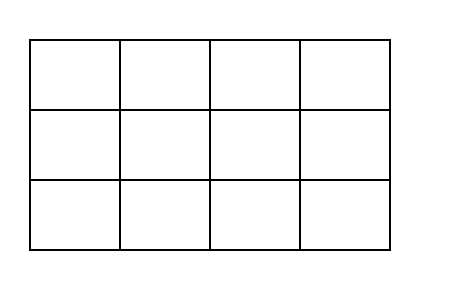

Now let's loosen the definition by swapping axis aligned line with (cubic) bezier curves.
We also choose to be free in the position of the vertices:

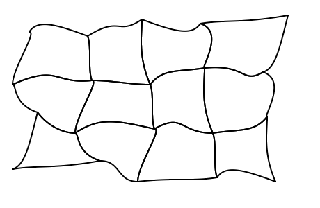

While funky lines are relatively interesting in their own rights, they are not that
interesting for a shading, so we associate a color to the vertices of the grid:

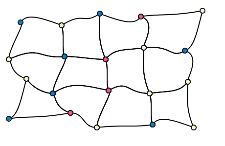

For every cell of the array, we want to fill it by interpolating the colors of
the vertices, by following the curves, possibly producing curved gradients
along the way:

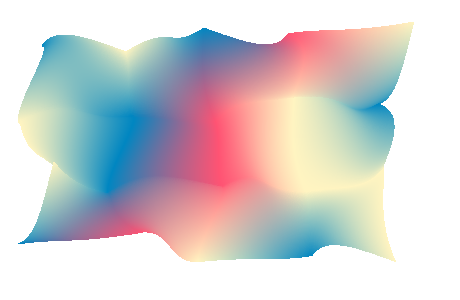

So here we are with our first gradient mesh. Defined by 5 by 4 vertices and their
associated colors and the bezier control points for the edges. A cell of this array
define a Coon patch, so 4 vertices and 4 edges and 4 colors. Knowing how to render
one coon patch gives the key to render the whole mesh, you just render each cell
individually.

Coon patch
----------

We are now focusing on a single coon patch:

The black circle are the vertice from the mesh patch, and the dark blue one not
in the corner are the control points for the cubic bezier curves, The control
mesh is drawn in dark blue.

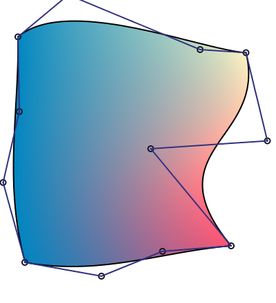

We can see that the color are the strongest in the corners, which
correspond to the vertice of the mesh.

The main idea is then to subdivide this patch up to a point where either it is
too small for further subdivision (if we are below the size of pixel for
instance) or if further subdivision won't refine color, if color are too close
we are not really interested.

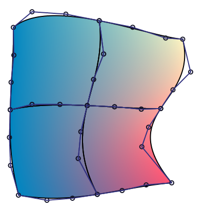

Managing to subdivide a coon patch in quadrant, means we can render our coon
patch. To represent coon patch in Haskell, we'll use the following data types:


```haskell
--
-- @
--                        ----->
--                  North     _____----------------+
--   ^          +------------/                     /
--   |         /                                  /       |
--   |        /                                  /        |
--   |       /                                  /  east   |
--   | west |                                  /          |
--          |                                 |           v
--           \                                 \   .
--            \                  __-------------+
--             +----------------/
--                    South
--                       <-----
-- @
--
data CoonPatch colors = CoonPatch
    { _north :: !CubicBezier
    , _east :: !CubicBezier
    , _south :: !CubicBezier
    , _west :: !CubicBezier
    , _coonValues :: !colors
    }
    deriving Show
```

`CoonPatch` represent the geomentry along with the colors stored in `_coonValues`. We
can argue that this storage is redundant because the first and last point of each
cubic bezier are shared, but manipulating a CubicBezier data types make things easier
down the line. To store the colors we use another data type:


```haskell
-- | Values associated to the corner of a patch
-- @
--  North           East
--      +----------+
--      |0        1|
--      |          |
--      |          |
--      |3        2|
--      +----------+
--  West            South
-- @
data ParametricValues a = ParametricValues
  { _northValue :: !a
  , _eastValue  :: !a
  , _southValue :: !a
  , _westValue  :: !a
  }
  deriving (Functor, Show)
```

A fully instantiated type for a coon patch may then be `CoonPatch (ParametricValues PixelRGBA8)`
(Using the pixel type from JuicyPixels)

A `CubicBezier` in encoded the following way:

```haskell
type Point = V2 Float

-- | Describe a cubic bezier spline, described
-- using 4 points.
--
-- > stroke 4 JoinRound (CapRound, CapRound) $
-- >    CubicBezier (V2 0 10) (V2 205 250) (V2 (-10) 250) (V2 160 35)
--
-- <<docimages/cubic_bezier.png>>
--
data CubicBezier = CubicBezier
  { -- | Origin point, the spline will pass through it.
    _cBezierX0 :: !Point
    -- | First control point of the cubic bezier curve.
  , _cBezierX1 :: !Point
    -- | Second control point of the cubic bezier curve.
  , _cBezierX2 :: !Point
    -- | End point of the cubic bezier curve
  , _cBezierX3 :: !Point
  }
  deriving Eq
```

`V2` being the Linear type for two component vector.

### Coon surface

We can now look to the mathematical definition of the coon surface, which
is defined by a simple equation:

$$ S = S_C + S_D - S_B $$

with each subsurface like:

                        C                            C (1)
            C (0)        1    _____----------------+  1
             1  +------------/                     /
               /                                  /        
              /                                  /         
             /                                  /  D       
       D    |                                  /    2      
        1   |                                 |            
             \                                 \        
              \                  __-------------+
               +----------------/                C (1)
          C (0)             C                     2
           2                 2

$$
S_C(u, v) = (1 - v) × C_1(u) + v × C_2(u), \\
S_D(u, v) = (1 - u) × D_1(v) + u × D_2(v), \\
S_B(u, v) = (1 - v) × [(1 - u) × C_1(0) + u × C_1(1) ] + v * [(1 - u) × C_2(0) + u × C_2(1)]
$$

We can see that $S_C$ is a linear interpolation between the top and bottom
bezier curve, $S_D$ a linear interpolation between the left and right curve.

Finally, $S_B$ is a bilinear interpolation between the four corner of the
coon patch. So by introducting a lerp function, we can rewrite the surfaces:

$$
S_C(u, v) = lerp(v, C_1(u), C_2(u)), \\
S_D(u, v) = lerp(u, D_1(v), D_2(v)), \\
S_B(u, v) = lerp(v, lerp(u, C_1(0), C_1(1)), lerp(u, C_2(0), C_2(1)))
$$

The $u$ and $v$ parameters are moving freely from 0 to 1 and are the UV
coordinate inside the patch.

With this definition at end, we can write a function to get back a single
point out of the surface:

```haskell
-- | Return a postion of a point in the coon patch.
coonPointAt :: CoonPatch a -> UV -> Point
coonPointAt CoonPatch { .. } (V2 u v) = sc ^+^ sd ^-^ sb
  where
    CubicBezier c10 _ _ c11 = _north
    CubicBezier c21 _ _ c20 = _south

    sc = lerp v c2 c1
    sd = lerp u d2 d1
    sb = lerp v (lerp u c21 c20)
                (lerp u c11 c10)

    CubicBezier _ _ _ c1 = fst $ cubicBezierBreakAt _north u
    CubicBezier _ _ _ c2 = fst $ cubicBezierBreakAt _south (1 - u)

    CubicBezier _ _ _ d2 = fst $ cubicBezierBreakAt _east v
    CubicBezier _ _ _ d1 = fst $ cubicBezierBreakAt _west (1 - v)
```

It uses the Linear library, with the `^+^` adding two vectors by performing
pairwize addition, `^-^` doing pairwise subtraction. For the renderer, we
want to divide the coon patch up to the pixel level, so we will use another
algorithm than sampling this function.

A little note on the
[`lerp`](http://hackage.haskell.org/package/linear-1.20.5/docs/src/Linear-Vector.html#line-152)
doing a linear interpolation between two vectors, it's current behaviour is the following one

```haskell
lerp 0 a b = b
lerp 1 a b = a
```

So the use of lerp may appear "reversed" compared to others lerp definitions (and
from the one in our formulas)

### Dividing a cubic bézier curve

We can use De Casteljau's algorithm to split a cubic bezier curve in two,
as our degree is known, we can directly unroll the implementation: 

~~~~{.haskell}
midPoint :: Point -> Point -> Point
midPoint a b = (a ^+^ b) ^* 0.5

divideCubicBezier :: CubicBezier -> (CubicBezier, CubicBezier)
divideCubicBezier bezier@(CubicBezier a _ _ d) = (left, right) where
  left = CubicBezier a ab abbc abbcbccd
  right = CubicBezier abbcbccd bccd cd d
  (ab, _bc, cd, abbc, bccd, abbcbccd) = splitCubicBezier bezier

splitCubicBezier :: CubicBezier -> (Point, Point, Point, Point, Point, Point)
splitCubicBezier (CubicBezier a b c d) = (ab, bc, cd, abbc, bccd, abbcbccd)
  where
    --                     BC
    --         B X----------X---------X C
    --    ^     /      ___/   \___     \     ^
    --   u \   /   __X------X------X_   \   / v
    --      \ /___/ ABBC       BCCD  \___\ /
    --    AB X/                          \X CD
    --      /                              \
    --     /                                \
    --    /                                  \
    -- A X                                    X D
    ab = a `midPoint` b
    bc = b `midPoint` c
    cd = c `midPoint` d

    abbc = ab `midPoint` bc
    bccd = bc `midPoint` cd
    abbcbccd = abbc `midPoint` bccd
~~~~

We introduce a new Linear operator `^*` which multiplies all the component of
the vector (on the left) by the scalar on the right.  We can also easily
represent a straight line using a cubic bezier curve:

~~~~ {.haskell}
straightLine :: Point -> Point -> CubicBezier
straightLine a b = CubicBezier a p1 p2 b where
  p1 = lerp (1/3) b a
  p2 = lerp (2/3) b a
~~~~

We can also flip the direction of a cubic bezier curve, without altearing
it's appearance

~~~~ {.haskell}
inverseBezier :: CubicBezier -> CubicBezier
inverseBezier (CubicBezier a b c d) = CubicBezier d c b a
~~~~

### Coon patch subdivision

To split a coon patch in two, we have to know how to produce
a new cubic bezier between the two new patch. Splitting a cubic
bezier for the edges will use the function defined above. We will
use the algorithm described in the paper "An efficient algorithm for
subdividing linear Coons surfaces"[1].

The main hindsight gained from the paper is how to calculate the contribution
of $S_D$ when spliting $S_C$ in two. The linear part ($S_B$) is still a bilinear
interpolation, the $S_C$ part is a direct interpolation of $C_1$ and $C_2$.

The contribution of $S_D$ when splitting $S_C$ is in fact a straight line
with endpoints the middle of $D_1$ and $D_2$. With these contribution, the
regular equation for $S$ can be applied. It can be noted that the paper use
a notation involving cardinal points which have been used when defining
the various data types.

The combination is then stated by the definition below:

~~~~ {.haskell}
-- | Calculate the new cubic bezier using equation for S
combine :: CubicBezier -> CubicBezier -> CubicBezier -> CubicBezier
combine (CubicBezier a1 b1 c1 d1)
        (CubicBezier a2 b2 c2 d2)
        (CubicBezier a3 b3 c3 d3) =
  CubicBezier (a1 ^+^ a2 ^-^ a3)
              (b1 ^+^ b2 ^-^ b3)
              (c1 ^+^ c2 ^-^ c3)
              (d1 ^+^ d2 ^-^ d3)
~~~~

And the proper subdivision for the coon patch is then:

~~~~ {.haskell}
-- | Split a coon patch in two vertically
--
-- @
--                        --------->
--                  North     +____----------------+
--   ^          +------------/:                    /
--   |         /              :                   /       |
--   |        /               :                  /        |
--   |       /               :                  /  east   |
--   | west |               :                  /          |
--          |               :                 |           v
--           \               :                 \    .   
--            \               :  __-------------+
--             +--------------+-/
--                    South
--                       <---------
-- @
--
subdividePatch :: CoonPatch (V2 CoonColorWeight)
               -> Subdivided (CoonPatch (V2 CoonColorWeight))
subdividePatch patch = Subdivided
    { _northWest = northWest
    , _northEast = northEast
    , _southWest = southWest
    , _southEast = southEast
    } where
  north@(CubicBezier nw _ _ ne) = _north patch
  south@(CubicBezier se _ _ sw) = _south patch

  -- Midpoints used for S_B
  midNorthLinear = nw `midPoint` ne
  midSouthLinear = sw `midPoint` se
  midWestLinear = nw `midPoint` sw
  midEastLinear = ne `midPoint` se

  -- These points are to calculate S_C and S_D
  (northLeft@(CubicBezier _ _ _ midNorth), northRight) = divideCubicBezier north
  (southRight, southLeft@(CubicBezier midSouth _ _ _ )) = divideCubicBezier south
  (westBottom, westTop@(CubicBezier midWest _ _ _)) = divideCubicBezier $ _west patch
  (eastTop@(CubicBezier _ _ _ midEast), eastBottom) = divideCubicBezier $ _east patch

  -- This points are to calculate S_B
  midNorthSouth = north `midCurve` south
  midEastWest = _east patch `midCurve` _west patch 

  -- Here we calculate S_D sub curves
  (splitNorthSouthTop, splitNorthSouthBottom) =
      divideCubicBezier $ combine
        midEastWest                                     -- S_D
        (midNorth `straightLine` midSouth)              -- S_C contribution
        (midNorthLinear `straightLine` midSouthLinear)  -- S_B contribution

  (splitWestEastLeft, splitWestEastRight) =
      divideCubicBezier $ combine
        midNorthSouth                                   -- S_C
        (midWest `straightLine` midEast)                -- S_D contribution
        (midWestLinear `straightLine` midEastLinear)    -- S_B contribution

  weights = subdivideWeights $ _coonValues patch

  -- reconstruction of the new sub-patches.
  northWest = CoonPatch
    { _west = westTop
    , _north = northLeft
    , _east = splitNorthSouthTop
    , _south = inverseBezier splitWestEastLeft
    , _coonValues = _northWest weights
    }

  northEast = CoonPatch
    { _west = inverseBezier splitNorthSouthTop
    , _north = northRight
    , _east = eastTop
    , _south = inverseBezier splitWestEastRight
    , _coonValues = _northEast weights
    }

  southWest = CoonPatch
    { _west = westBottom
    , _north = splitWestEastLeft
    , _east = splitNorthSouthBottom
    , _south = southLeft
    , _coonValues = _southWest weights
    }

  southEast = CoonPatch
    { _west = inverseBezier splitNorthSouthBottom
    , _north = splitWestEastRight
    , _east = eastBottom
    , _south = southRight
    , _coonValues = _southEast weights
    }
~~~~

### Color weight subdivision

The coon function use a `subdivideWeights` function to subdivide
the weight at the corner of the patch, this is a straightforward
operation, the `ParametricValues` data type is a generic data type
storing values for the four corner of the patch.
We don't directly interpolate pixels, but instead the UV parametric coordinate
within the patch. Subdividing it is just creating new squares with
new coordinate using midPoints.

~~~~ {.haskell}
subdivideWeights :: ParametricValues (V2 CoonColorWeight)
                 -> Subdivided (ParametricValues (V2 CoonColorWeight))
subdivideWeights values = Subdivided { .. } where
  ParametricValues
    { _westValue = west
    , _northValue = north
    , _southValue = south
    , _eastValue = east
    } = values

  --  N       midNorth    E
  --      +-------+------+
  --      |0      :     1|
  --   mid|   grid:Mid   |
  --  West+=======:======+ midEast
  --      |       :      |
  --      |3      :     2|
  --      +-------+------+
  --  W       midSouth    S
  midNorthValue = north `midPoint` east
  midWestValue = north `midPoint` west
  midSoutValue = west `midPoint` south
  midEastValue = east `midPoint` south

  gridMidValue = midSoutValue `midPoint` midNorthValue

  _northWest = ParametricValues
    { _northValue = north
    , _eastValue = midNorthValue
    , _southValue = gridMidValue
    , _westValue = midWestValue
    }

  _northEast = ParametricValues
    { _northValue = midNorthValue
    , _eastValue = east
    , _southValue = midEastValue
    , _westValue = gridMidValue
    }

  _southWest = ParametricValues
    { _northValue = midWestValue
    , _eastValue  = gridMidValue
    , _southValue = midSoutValue
    , _westValue = west
    }
  
  _southEast = ParametricValues
    { _northValue = gridMidValue
    , _eastValue = midEastValue
    , _southValue = south
    , _westValue = midSoutValue
    }
~~~~

It is assumed that the original weight are a unit square:

     0,0                1,0
        +--------------+
        |              |
        |              |
        |              |
        |              |
        |              |
        +--------------+
     0,1               1,1

### Rendering

We just need a way to convert between UV coordinates to real color
to fill our canvas, it is rather simple, if we store the initial
pixel in ParametricValues, we just have to perform a bilinear interpolation
to get the final color:

~~~~ {.haskell}
meanValue :: ParametricValues (V2 CoonColorWeight) -> V2 CoonColorWeight
meanValue = (^* 0.25) . getSum . foldMap Sum

-- | Interpolate a 2D point in a given type
class BiSampleable sampled px | sampled -> px where
  -- | The interpolation function
  interpolate :: sampled -> Float -> Float -> px

-- | Basic bilinear interpolator
instance BiSampleable (ParametricValues PixelRGBA8) PixelRGBA8 where
  {-# INLINE interpolate #-}
  interpolate = bilinearPixelInterpolation

bilinearPixelInterpolation :: ParametricValues PixelRGBA8 -> Float -> Float -> PixelRGBA8
bilinearPixelInterpolation (ParametricValues { .. }) !dx !dy = 
  lerpColor dy (lerpColor dx _northValue _eastValue) (lerpColor dx _westValue _southValue)
  where
   lerpWord8 zeroToOne a b =
      floor $ (1 - zeroToOne) * fromIntegral a + zeroToOne fromIntegral b
   lerpColor zeroToOne (PixelRGBA8 r g b a) (PixelRGBA8 r' g' b' a') =
      PixelRGBA8
        (lerpWord8 zeroToOne r r')
        (lerpWord8 zeroToOne g g')
        (lerpWord8 zeroToOne b b')
        (lerpWord8 zeroToOne a a')

~~~~

We now have everything that is needed to render the coon patch, using
a dumb heuristic to enhance later we can write the rendering code,
assuming that we already have a rasterizer (like Rasterific) that
can fill a path with cubic bezier.

~~~~ {.haskell}
renderCoonPatch :: forall interp s.  (BiSampleable interp PixelRGBA8)
                => CoonPatch interp -> DrawContext (ST s) PixelRGBA8 ()
renderCoonPatch originalPatch = go maxDeepness basePatch where
  maxDeepness = maxColorDeepness baseColors
  baseColors = _coonValues originalPatch

  basePatch = originalPatch { _coonValues = parametricBase }

  -- Here we draw the patch as a regular "PATH" with any
  -- rendering engine
  drawPatchUniform CoonPatch { .. } = fillWithTextureNoAA FillWinding texture geometry where
    geometry = toPrim <$> [_north, _east, _south, _west]
    !(V2 u v) =meanValue _coonValues
    !texture = SolidTexture $ interpolate baseColors u v

  go 0 patch = drawPatchUniform patch
  go depth (subdividePatch -> Subdivided { .. }) =
    let d = depth - (1 :: Int) in
    go d _northWest >> go d _northEast >> go d _southWest >> go d _southEast
~~~~

To have an idea of the process, here's a GIF of various subdivision levels.
At some points there is too much different colors to have a correct encoding
and the dithering scramble it a bit:

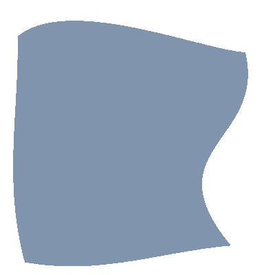

Tensor Patch
------------

What if we want to control more precisely how the color spread within a patch?

With a coon patch this is rather limited, but we have another tool to do this,
the tensor patch. Here is both side by side, the coon patch on the left, the
tensor patch on the right:


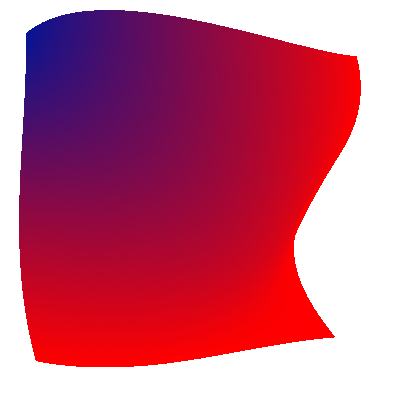


There is a difference of construction between the two, the Tensor patch is
made of a matrix of 4x4 points with points in the middle of the matrix helping
to "drag" the color one way or another:

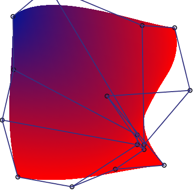

In the patch below, each circle represent a control point of the tensor patch,
the curves defined by these points are ommited for clarity.

### Tensor patch subdivision

So a nice little tensor patch:


Which has the control mesh: (this time with curve outline
drawn):

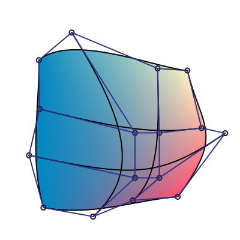

So the basic subdivision technique is to split each of the
4 cubic bezier curve in each direction:


We can then interpret the matrix in the other direction (vertically),
and subdivide again the tensor patch. Here we subdivide vertically
just the right patch:

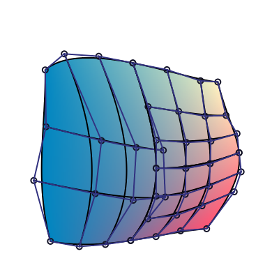

### Subdivision

We can simply switch orientation of a tensor patch by transposing
its coefficients:

~~~~ {.haskell}
data TensorPatch px = TensorPatch
  { _curve0 :: !CubicBezier
  , _curve1 :: !CubicBezier
  , _curve2 :: !CubicBezier
  , _curve3 :: !CubicBezier
  , _tensorValues :: !(ParametricValues px)
  }

transposeParametricValues :: ParametricValues a -> ParametricValues a
transposeParametricValues (ParametricValues n e s w) = ParametricValues n w s e

transposePatch :: TensorPatch px -> TensorPatch px
transposePatch TensorPatch
  { _curve0 = CubicBezier c00 c01 c02 c03
  , _curve1 = CubicBezier c10 c11 c12 c13
  , _curve2 = CubicBezier c20 c21 c22 c23
  , _curve3 = CubicBezier c30 c31 c32 c33
  , _tensorValues = values
  } = TensorPatch
    { _curve0 = CubicBezier c00 c10 c20 c30
    , _curve1 = CubicBezier c01 c11 c21 c31
    , _curve2 = CubicBezier c02 c12 c22 c32
    , _curve3 = CubicBezier c03 c13 c23 c33
    , _tensorValues = transposeParametricValues values
    }
~~~~

We then just have to subdivide horizontally

~~~~ {.haskell}
horizontalTensorSubdivide :: TensorPatch (V2 CoonColorWeight)
                          -> (TensorPatch (V2 CoonColorWeight), TensorPatch (V2 CoonColorWeight))
horizontalTensorSubdivide p = (TensorPatch l0 l1 l2 l3 vl, TensorPatch r0 r1 r2 r3 vr) where
  (l0, r0) = divideCubicBezier $ _curve0 p
  (l1, r1) = divideCubicBezier $ _curve1 p
  (l2, r2) = divideCubicBezier $ _curve2 p
  (l3, r3) = divideCubicBezier $ _curve3 p
  (vl, vr) = subdivideHorizontal $ _tensorValues p
~~~~

And we can finally subdivide the patch in 4 subpatch:

~~~~ {.haskell}
subdivideTensorPatch :: TensorPatch (V2 CoonColorWeight)
                     -> Subdivided (TensorPatch (V2 CoonColorWeight))
subdivideTensorPatch p = subdivided where
  (west, east) = horizontalTensorSubdivide p
  (northWest, southWest) = horizontalTensorSubdivide $ transposePatch west
  (northEast, southEast) = horizontalTensorSubdivide $ transposePatch east
  subdivided = Subdivided
    { _northWest = northWest
    , _northEast = northEast
    , _southWest = southWest
    , _southEast = southEast
    }
~~~~

The global rendering is similar to the one of the coon patch, so it won't
be displayed here.

Coon patch to tensor patch
--------------------------

A tensor patch have 4 additional compared to the coon patch. It is therefore
more complex, and we could pass from the coon patch to the tensor one. If
$S(u,v)$ is the point at the position u, v on the coon surface, the 4
additional points are expressed in the following way in the PDF reference 1.7,
and in various articles:

$$
\begin{matrix}
p11 & = & S(1/3, 1/3) \\
p21 & = & S(2/3, 1/3) \\
p12 & = & S(1/3, 2/3) \\
p22 & = & S(2/3, 2/3)
\end{matrix}
$$

With this, converting the following gradient mesh (expressed using the
SVG2.0 Draft syntax):

```xml
<?xml version="1.0" encoding="UTF-8" standalone="no"?>
<svg xmlns="http://www.w3.org/2000/svg" xmlns:xlink="http://www.w3.org/1999/xlink"
   version="1.1" width="400" height="400">
  <defs>
    <meshgradient x="54" y="163" id="meshgradient1" gradientUnits="userSpaceOnUse">
      <meshrow>
		<meshpatch>
		  <stop path="C  68, 110, 110,  68, 163,  54"  stop-color="red"    />
		  <stop path="C 153,  82, 148, 111, 143, 143"  stop-color="red"    />
		  <stop path="L 143, 143"                      stop-color="white " />
		  <stop path="C 113, 146,  82, 153"            stop-color="white"  />
		</meshpatch>
		<meshpatch>
		  <stop path="C 245,  35, 325,  83, 345, 163"                      />
		  <stop path="C 281, 138, 209, 136, 143, 143"  stop-color="red"    />
		  <stop path="L 143, 143"                      stop-color="white"  />
		</meshpatch>
		<meshpatch>
		  <stop path="C 374, 273, 273, 374, 163, 345"                      />
		  <stop path="C 138, 281, 136, 209, 143, 143"  stop-color="red"    />
		  <stop path="L 143, 143"                      stop-color="white " />
		</meshpatch>
		<meshpatch>
		  <stop path="C  83, 325,  35, 245,  54, 163"                      />
		  <stop path="C  82, 153, 111, 148, 143, 143"  stop-color="red"    />
		  <stop path="L 143, 143"                      stop-color="white " />
		</meshpatch>
       </meshrow>
     </meshgradient>
  </defs>
  <rect width="360" height="360" x="20" y="20" style="fill:url(#meshgradient1); stroke:red" />
</svg>
```

and render it as a bunch of tensor patches:


You can see the lines in the border of the patches, and the diamond shape
of the white hallow?

Well it's total crap, even if intuitive and elegant, putting the control points
at third of the bezier distance is just wrong, we can get a intuition into
the problem by plotting the curve and control points of the previous rendering:

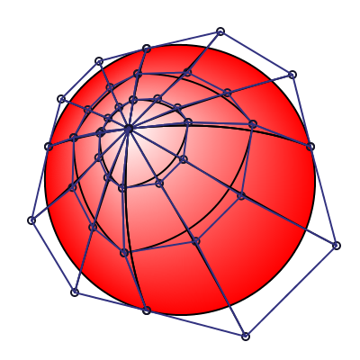

We can see the near straight line formed with the additional control points,
whereas the original render is much smoother and "round". The answer is elsewhere,
thanks to the one giving the pointer in the Cairo source code, indicating the
[ISO32000](http://www.adobe.com/content/dam/Adobe/en/devnet/acrobat/pdfs/PDF32000_2008.pdf)
document, an ISO standard describing the PDF format, with another set of formula to transform
coon patches to tensor patches:

$$
\begin{matrix}
p_{11} & = & 1/9 \times \left(
    -4 \times p_{00} +
    6 \times (p_{01} + p_{10}) -
    2 \times (p_{03} + p_{30}) +
    3 \times (p_{31} + p_{13}) -
    1 \times p_{33} \right) \\
p_{12} & = & 1/9 \times \left(
    -4 \times p_{03} +
    6 \times (p_{02} + p_{13}) -
    2 \times (p_{00} + p_{33}) +
    3 \times (p_{32} + p_{10}) -
    1 \times p_{30} \right) \\
p_{21} & = & 1/9 \times \left(
    -4 \times p_{30} +
    6 \times (p_{31} + p_{20}) -
    2 \times (p_{33} + p_{00}) +
    3 \times (p_{01} + p_{23}) -
    1 \times p_{03} \right) \\
p_{22} & = & 1/9 \times \left(
    -4 \times p_{33} +
    6 \times (p_{32} + p_{23}) -
    2 \times (p_{30} + p_{03}) +
    3 \times (p_{02} + p_{20}) -
    1 \times p_{00} \right)
\end{matrix}
$$

Using these new formulas, we obtain this rendering:

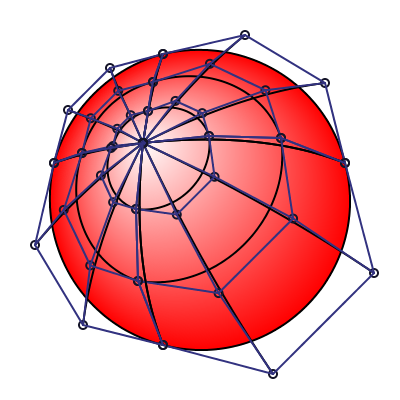

We can see that the control points are further from the center and
we obtain a much better smoothing of the white color accross
the circle:

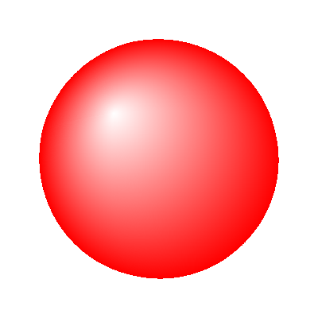

Much better :)

Bicubic interpolation
---------------------

Let's return to our whole mesh gradient for a moment:


If we look at the render closely, we can see that the edges are apparent, as we
use bilinear interpolation inside a patch, a neighbour patch with really different
colors on the oposite vertices will create a visible discontinuity, hence the
visibility of the edges.

To handle this problem, the SVG2 draft document propose to choose between two
interpolation scheme for rendering: bilinear and bicubic (bilinear being the
default one). Using the bicubic method, we obtain a much smoother rendering:

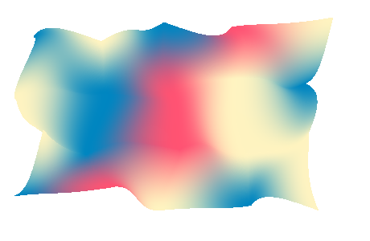

We can still see the mesh edges on certain cases, but it's globally smoother.
We can use the parametricity of our types to switch from a normal mesh patch to
a one that will interpolate with cubic interpolation. We can first store the
slope information at every vertice of the mesh:

```haskell
-- | Store the derivative necessary for cubic interpolation in
-- the gradient mesh. We use tiny vectors because we need coefficients
-- for every color component in the image.
data Derivative px = Derivative
  { _derivValues  :: !(V4 Float)
  , _xDerivative  :: !(V4 Float)
  , _yDerivative  :: !(V4 Float)
  , _xyDerivative :: !(V4 Float)
  }

-- | Prepare a gradient mesh to use cubic color interpolation, see
-- renderCubicMesh documentation to see the global use of this function.
calculateMeshColorDerivative :: MeshPatch PixelRGBA8 -> MeshPatch (Derivative pPixelRGBA8)
calculateMeshColorDerivative mesh = mesh { _meshColors = colorDerivatives } where
  colorDerivatives =
     V.fromListN (w * h) [interiorDerivative x y | y <- [0 .. h - 1], x <- [0 .. w - 1]]

  w = _meshPatchWidth mesh + 1
  h = _meshPatchHeight mesh + 1
  clampX = max 0 . min (w - 1)
  clampY = max 0 . min (h - 1)
  toFloatPixel (PixelRGBA8 r g b a) =
    V4 (fromIntegral r) (fromIntegral g) (fromIntegral b) (fromIntegral a)    

  rawColorAt x y =_meshColors mesh V.! (y * w + x)
  atColor x y = toFloatPixel $ rawColorAt (clampX x) (clampY y)
  pointAt x y = verticeAt mesh (clampX x) (clampY y)
  derivAt x y = colorDerivatives  V.! (y * w + x)

  interiorDerivative x y = Derivative thisColor dx dy dxy
    where
      dx = slopeBasic cxPrev cxNext xPrev xNext
      dy = slopeBasic cyPrev cyNext yPrev yNext

      dxy | nearZero xyDist = zero
          | otherwise = (cxyNext ^-^ cyxPrev ^-^ cyxNext ^+^ cxyPrev) ^/ (xyDist)
      xyDist = (xNext `distance` xPrev) * (yNext `distance` yPrev)

      cxyPrev = atColor (x - 1) (y - 1)
      xyPrev = pointAt (x - 1) (y - 1)

      cxyNext = atColor (x + 1) (y + 1)
      xyNext = pointAt (x + 1) (y + 1)

      cyxPrev = atColor (x - 1) (y + 1)
      yxPrev = pointAt (x - 1) (y + 1)

      cyxNext = atColor (x + 1) (y - 1)
      yxNext = pointAt (x + 1) (y - 1)

      cxPrev = atColor (x - 1) y
      thisColor = atColor x y
      cxNext = atColor (x + 1) y
      
      cyPrev = atColor x (y - 1)
      cyNext = atColor x (y + 1)
      
      xPrev = pointAt (x - 1) y
      this  = pointAt x y
      xNext = pointAt (x + 1) y
      
      yPrev = pointAt x (y - 1)
      yNext = pointAt x (y + 1)
```

And when extracting a single patch, use the calculation used in the
[Wikipedia](https://en.wikipedia.org/wiki/Bicubic_interpolation) article to
compute the final coefficients of our interpolation:

```haskell
-- | Store information for cubic interpolation in a patch.
newtype CubicCoefficient px = CubicCoefficient
    { getCubicCoefficients :: ParametricValues (V4 (V4 Float))
    }

rawMatrix :: V.Vector (V.Vector Float)
rawMatrix = V.fromListN 16 $ V.fromListN 16 <$>
  [ [ 1, 0, 0, 0,  0, 0, 0, 0,  0, 0, 0, 0,  0, 0, 0, 0 ]
  , [ 0, 0, 0, 0,  1, 0, 0, 0,  0, 0, 0, 0,  0, 0, 0, 0 ]
  , [-3, 3, 0, 0, -2,-1, 0, 0,  0, 0, 0, 0,  0, 0, 0, 0 ]
  , [ 2,-2, 0, 0,  1, 1, 0, 0,  0, 0, 0, 0,  0, 0, 0, 0 ]
  , [ 0, 0, 0, 0,  0, 0, 0, 0,  1, 0, 0, 0,  0, 0, 0, 0 ]
  , [ 0, 0, 0, 0,  0, 0, 0, 0,  0, 0, 0, 0,  1, 0, 0, 0 ]
  , [ 0, 0, 0, 0,  0, 0, 0, 0, -3, 3, 0, 0, -2,-1, 0, 0 ]
  , [ 0, 0, 0, 0,  0, 0, 0, 0,  2,-2, 0, 0,  1, 1, 0, 0 ]
  , [-3, 0, 3, 0,  0, 0, 0, 0, -2, 0,-1, 0,  0, 0, 0, 0 ]
  , [ 0, 0, 0, 0, -3, 0, 3, 0,  0, 0, 0, 0, -2, 0,-1, 0 ]
  , [ 9,-9,-9, 9,  6, 3,-6,-3,  6,-6, 3,-3,  4, 2, 2, 1 ]
  , [-6, 6, 6,-6, -3,-3, 3, 3, -4, 4,-2, 2, -2,-2,-1,-1 ]
  , [ 2, 0,-2, 0,  0, 0, 0, 0,  1, 0, 1, 0,  0, 0, 0, 0 ]
  , [ 0, 0, 0, 0,  2, 0,-2, 0,  0, 0, 0, 0,  1, 0, 1, 0 ]
  , [-6, 6, 6,-6, -4,-2, 4, 2, -3, 3,-3, 3, -2,-1,-2,-1 ]
  , [ 4,-4,-4, 4,  2, 2,-2,-2,  2,-2, 2,-2,  1, 1, 1, 1 ]
  ]

cubicPreparator :: ParametricValues (Derivative PixelRGBA8)
                -> CubicCoefficient PixelRGBA8
cubicPreparator ParametricValues { .. } =
    CubicCoefficient $ ParametricValues (sliceAt 0) (sliceAt 4) (sliceAt 8) (sliceAt 12) where
  Derivative c00 fx00 fy00 fxy00 = _northValue
  Derivative c10 fx10 fy10 fxy10 = _eastValue
  Derivative c01 fx01 fy01 fxy01 = _westValue
  Derivative c11 fx11 fy11 fxy11 = _southValue

  resultVector = mulVec $ V.fromListN 16
    [  c00,   c10,   c01,   c11
    , fx00,  fx10,  fx01,  fx11 
    , fy00,  fy10,  fy01,  fy11 
    ,fxy00, fxy10, fxy01, fxy11
    ]

  mulVec vec = VG.foldl' (^+^) zero . VG.zipWith (^*) vec <$> rawMatrix

  sliceAt i = V4 
    (resultVector V.! i)
    (resultVector V.! (i + 1))
    (resultVector V.! (i + 2))
    (resultVector V.! (i + 3))
```

Storing the cubic coefficients in a `V4` is a bit a hacky way to do it,
but it let us store a 16 element vector easily. Finally to let us render the patch with the
correct interpolation, we can roll a new instance of `BiSampleable`, just making a big
dot product between the coefficients and our current position.

```haskell
-- | Bicubic interpolator
instance BiSampleable (CubicCoefficient PixelRGBA8) PixelRGBA8 where
  interpolate = bicubicInterpolation

bicubicInterpolation :: CubicCoefficient PixelRGBA8 -> Float -> Float -> PixelRGBA8
bicubicInterpolation params x y =
  fromFloatPixel . fmap clamp $ af ^+^ bf ^+^ cf ^+^ df
  where
    ParametricValues a b c d = getCubicCoefficients params
    clamp = max 0 . min 255
    -- we are really doing the dot product of two vector by hand, but
    -- each element is not a scalar but a 4 element vector representing
    -- the color
    xv, vy, vyy, vyyy :: V4 Float
    xv = V4 1 x (x*x) (x*x*x)
    vy = xv ^* y
    vyy = vy ^* y
    vyyy = vyy ^* y

    v1 ^^*^ v2 = (^*) <$> v1 <*> v2

    V4 af bf cf df = (a ^^*^ xv) ^+^ (b ^^*^ vy) ^+^ (c ^^*^ vyy) ^+^ (d ^^*^ vyyy)
```

Gradient mesh to image mesh
---------------------------

Ok, enough with interpolations, let's try something else. We're going to start
with a picture:


Put a conceptual mesh grid on top of this image

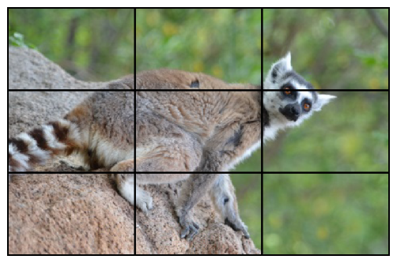

Shake the vertices of the mesh

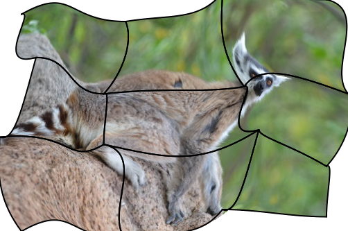

And voilà, a wonderful distorted image:


Any resemblance to previous techniques is purely indented. Sadly this part is not
in the SVG2 draft spec.

### Another parametrization

Each patch interpolate within [0, 1]², so instead of interpolating between
the four corner colors, we can just fetch pixels from an image. To store the information
of a patch we need a new data type:

```haskell
-- | Type storing the information to be able to interpolate
-- part of an image in a patch.
data ImageMesh px = ImageMesh
    { _meshImage :: !(Image px)
    , _meshTransform :: !Transformation
    }
```

The transformation is there to change space from the UV parametric space to the
image space, and just fetch the pixel at the good position. I'll spare the
implementation as there is not that much to do here, but it all boil down
to just a new instance of `BiSampleable`

If you forget to transform, you're in for a weird image with many patches:


Making it faster
----------------

So, we have a simple implementation relying only on subdivision, and heavy
subdivision is not that cheap and can result on some massive overdraw if
not tuned properly (like in the code given in the sections above). And the
result are not that great when interpolating an image.

So we can't really rely only on this algorithm for rendering. The real algorithm in use
in Rasterific right now is the Fast Forward Differencing (explained in details
on [scratchapixel](http://www.scratchapixel.com/lessons/advanced-rendering/bezier-curve-rendering-utah-teapot/fast-forward-differencing)).

With this algorithm, you go from the parametric version of the cubic bezier curve:

$$ P(t) = P _ 0 (1 - t) ^ 3 + 3 P _ 1 t (1 - t) ^ 2 + 3 P _ 2 t^2 (1 - t) + P_3 t ^ 3 $$

to three addition between each pixel (more or less).


<!--
### Deriving parametric equation from De Casteljau

With a bit of formula manipulation, we can get the correspondance between
the parametric formulation and the De Casteljau's algorithm. A quick and dirty
symbolic manipulation below using sympy:

```python
from sympy import *
from distribution import *
from sympy.matrices import *

def lerp(a, b, t):
    return (1 - t) * a + t * b

def bezier_castel(t, p0, p1, p2, p3):
    p01 = lerp(p0, p1, t)
    p12 = lerp(p1, p2, t)
    p23 = lerp(p2, p3, t)

    p0112 = lerp(p01, p12, t)
    p1223 = lerp(p12, p23, t)

    return lerp(p0112, p1223, t)

def bezier(t, p0, p1, p2, p3):
    return (     p0     *      (1 - t) ** 3 +
             3 * p1 * t *      (1 - t) ** 2 +
             3 * p2 * t ** 2 * (1 - t) +
                 p3 * t ** 3)

def casteljau_identical():
    p0, p1, p2, p3 = symbols('p0 p1 p2 p3')
    t = symbols('t')

    castel = expand(bezier_castel(t, p0, p1, p2, p3))
    raw = expand(bezier(t, p0, p1, p2, p3))

    print("De Casteljau formula")
    print("====================")
    pprint(castel, wrap_line=False)

    print("Raw parametric cubic bezier curve")
    print("=================================")
    pprint(raw, wrap_line=False)

    print("Difference, if == 0 then we can consider identical")
    print("==================================================")
    pprint(castel - raw, wrap_line=False)
```

The difference is at 0, and the expanded formula of both versions are identical.

`Qed.` (for coq user)
-->

### Forward differentiation

The core of the algorithm is to be able to go to step $n$ to step $n+1$
with small steps, doing that with only one level will only give us a
straight line, as we're playing with a cubic equation, we will have to
apply multiple time the forward differentiation operator.

The forward difference operator is defined as:
$$ ffd(f, t) = f(t + h) - f(t) $$

Where $h$ is the step size open to choice.  We are interested to setup the
coefficients for the first point of the curve (ie. for $t = 0$), and initially,
we initially want a step of 1, thus:

 * $t = 0$
 * $h = 1$

So using the bezier equation:

$$ P(t) = P _ 0 (1 - t) ^ 3 + 3 P _ 1 t (1 - t) ^ 2 + 3 P _ 2 t^2 (1 - t) + P_3 t ^ 3 $$

With a bit of rewriting (and the help of sympy to perform symbolic computations), we obtain:

$$
ffd_1(t) = ffd(P, t) = - h^3 p_0 + 3 h^3 p_1 - 3 h^3 p_2 + \\
    h^3 p_3 + 3 h^2 p_0 - 6 h^2 p_1 + 3 h^2 p_2 - 3 h p_0 + \\
    3 h p_1 + t^2 (- 3 h p_0 + 9 h p_1 - 9 h p_2 + 3 h p_3) + \\
    t (- 3 h^2 p_0 + 9 h^2 p_1 - 9 h^2 p_2 + 3 h^2 p_3 + \\
    6 h p_0 - 12 h p_1 + 6 h p_2)
$$

which simplify to

$$ ffd_1(0) = - p_0 + p_3 $$

in our case

In a similar way, we calculate second and third order differentiation:

$$
\begin{matrix}
ffd_2(t) & = & ffd(ffd_1, t) \\
ffd_2(0) & = & 6 p_1 - 12 p_2 + 6 p_3
\end{matrix}
$$

And

$$
\begin{matrix}
ffd_3(t) & = & ffd(ffd_2, t) \\
ffd_3(0) & = & - 6 p_0 + 18 p_1 - 18 p_2 + 6 p_3
\end{matrix}
$$

We can try to calculate the fourth order, but it won't yield anything:

$$
ffd_4(t) = ffd(ffd_3, t) = 0
$$

So we can stop.

So using this information, we set up our initial coefficients

$$
\begin{matrix}
X & = & x_0 \\
A & = & ffd_1(0) \\
B & = & ffd_2(0) \\
C & = & ffd_3(0)
\end{matrix}
$$

And we can make an step evaluation step with a simple summation:

$$
\begin{matrix}
X' & = & X + A \\
A' & = & A + B \\
B' & = & B + C \\
C' & = & C
\end{matrix}
$$

Which is a far cheaper computation
### Cubic bezier rasterization using Forward difference

With these tools at hand, we can now write down data structure
and conversion functions.

```haskell
data ForwardDifferenceCoefficient = ForwardDifferenceCoefficient
    { _fdA :: {-# UNPACK #-} !Float
    , _fdB :: {-# UNPACK #-} !Float
    , _fdC :: {-# UNPACK #-} !Float
    }

-- | Given a cubic curve, return the initial step size and
-- the coefficient for the forward difference.
-- Initial step is assumed to be "1"
bezierToForwardDifferenceCoeff
    :: CubicBezier
    -> V2 ForwardDifferenceCoefficient
bezierToForwardDifferenceCoeff (CubicBezier x y z w) = V2 xCoeffs yCoeffs
  where
    xCoeffs = ForwardDifferenceCoefficient { _fdA = ax, _fdB = bx, _fdC = cx }
    yCoeffs = ForwardDifferenceCoefficient { _fdA = ay, _fdB = by, _fdC = cy }

    V2 ax ay = w ^-^ x -- ffd_1
    V2 bx by = (w ^-^ z ^* 2 ^+^ y) ^* 6 -- ffd_2
    V2 cx cy = (w ^-^ z ^* 3 ^+^ y ^* 3 ^-^ x) ^* 6 -- ffd_3

halveFDCoefficients :: ForwardDifferenceCoefficient -> ForwardDifferenceCoefficient
halveFDCoefficients (ForwardDifferenceCoefficient a b c) =
    ForwardDifferenceCoefficient { _fdA = a', _fdB = b', _fdC = c' }
  where
    c' = c * 0.125          -- c * 0.5 ^ 3
    b' = b * 0.25 - c'      -- b * 0.5 ^ 2 - c * 0.5 ^ 3
    a' = (a - b') * 0.5
```

We used $h = 1$ to simplify the calculations, which is far too big
for our purpose, so we can halves the coefficients after to get almost a
pixel per step (see [1])

```haskell
updateForwardDifferencing :: ForwardDifferenceCoefficient -> ForwardDifferenceCoefficient
updateForwardDifferencing (ForwardDifferenceCoefficient a b c) =
  ForwardDifferenceCoefficient (a + b) (b + c) c

updatePointsAndCoeff :: (Applicative f', Applicative f, Additive f)
                     => f' (f Float) -> f' (f ForwardDifferenceCoefficient)
                     -> (f' (f Float), f' (f ForwardDifferenceCoefficient))
updatePointsAndCoeff pts coeffs =
    (advancePoint <$> pts <*> coeffs, fmap updateForwardDifferencing <$> coeffs)
  where
    fstOf (ForwardDifferenceCoefficient a _ _) = a
    advancePoint v c = v ^+^ (fstOf <$> c)
rasterizerCubicBezier :: (PrimMonad m, ModulablePixel px, BiSampleable src px)
                      => src -> CubicBezier -> UV -> UV -> DrawContext m px ()
rasterizerCubicBezier source bez uvStart uvEnd = do
  canvas <- get
  let baseFfd = bezierToForwardDifferenceCoeff bez
      shiftCount = estimateFDStepCount bez
      maxStepCount :: Int
      maxStepCount = 1 `unsafeShiftL` shiftCount
      coeffStart = fixIter shiftCount halveFDCoefficients <$> baseFfd
      V2 du dv = (uvEnd ^-^ uvStart) ^/ fromIntegral maxStepCount
      
      go !currentStep _ _ _ _
        | currentStep >= maxStepCount = return ()
      go !currentStep !coeffs !p@(V1 (V2 x y)) !u !v = do
        let !(pNext, coeffNext) = updatePointsAndCoeff p coeffs
            !color = interpolate source (V2 u v)
        plotPixel canvas color (floor x) (floor y)
        go (currentStep + 1) coeffNext pNext (u + du) (v + dv)

  lift $ go 0 (V1 coeffStart) (V1 $ _cBezierX0 bez) du dv
```

To render our tensor patch, we interpolate accross the 4 cubic
bezier of the patch in one direction, and rasterize a curve made
of the 4 current point at each positions, yielding the final render.


Conclusion
----------

So here is the end of our journey into the gradient mesh rendering for SVG2,
these features will be released with the
[Rasterific](https://github.com/Twinside/Rasterific) 0.7 and the associated
packages ([svg-tree](https://github.com/Twinside/svg-tree) &
[rasterific-svg](https://github.com/Twinside/rasterific-svg)). So let's hope
browser implement quickly the support for this new feature to allow more usage
of this interesting gradient object.

Bugs
----

Glitches are a nice, here's a collection of the nicest ones:

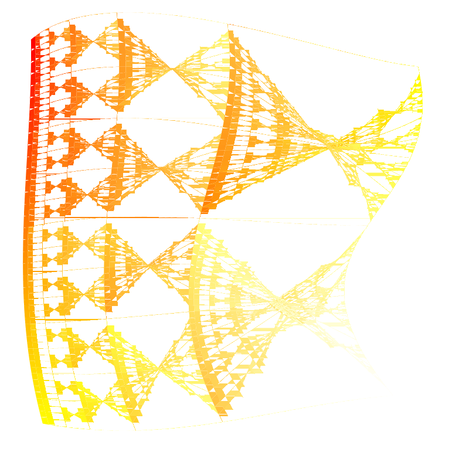

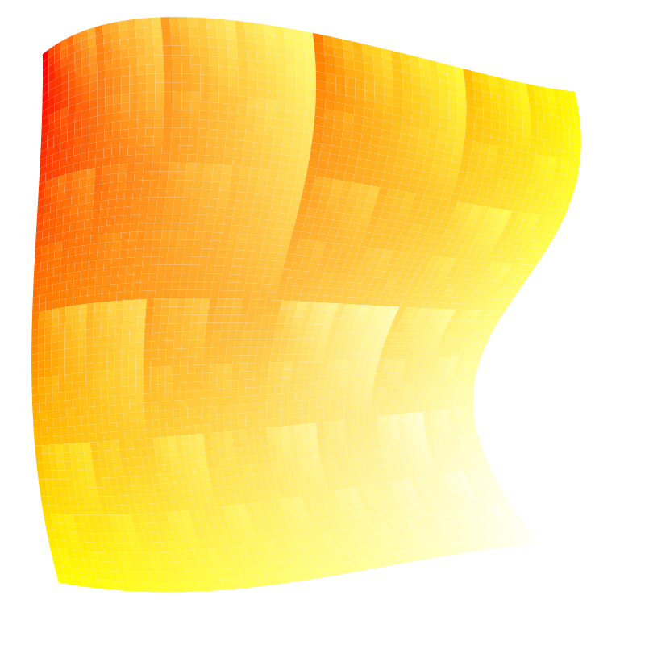{ width=400 height=400 }

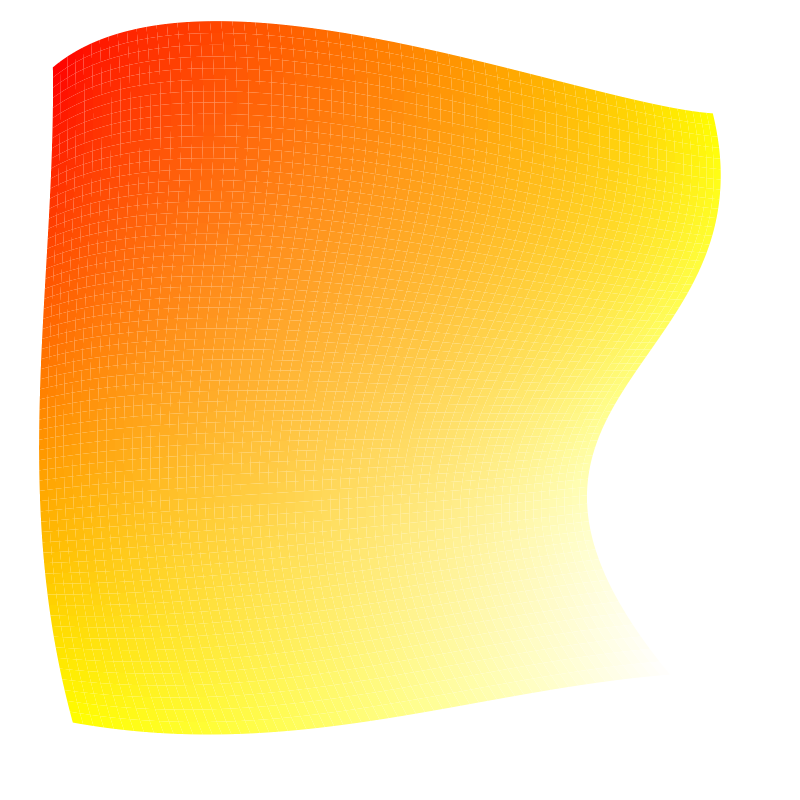{ width=400 height=400 }

The grid appearing in the picture above is what happen when we don't disable anti aliasing.

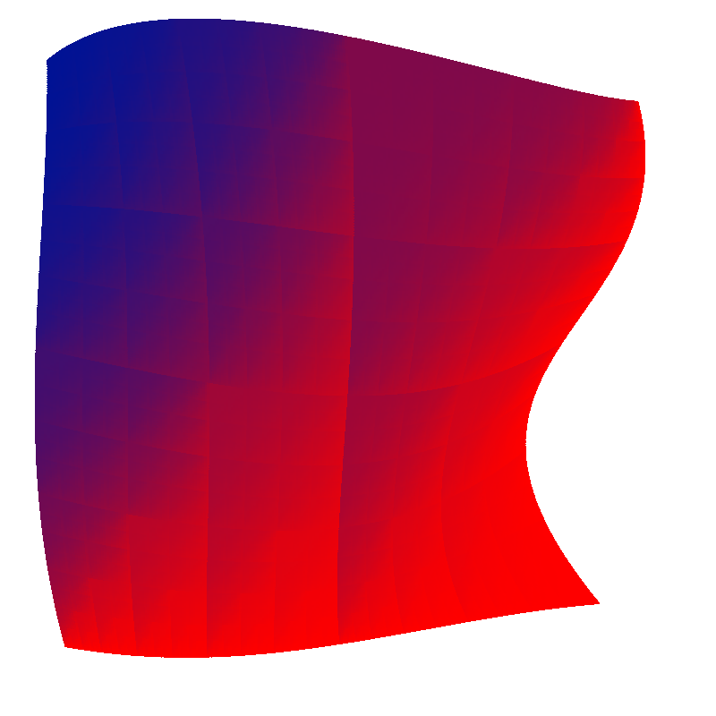{ width=400 height=400 }

Reference
---------

[1] Chengfu Yao, Jon Rokne 
An efficient algorithm for subdividing linear Coons surfaces
Article in Computer Aided Geometric Design 8(4):291-303 · October 1991

[2] Paul S. Heckbert,
Bilinear Coons Patch Image Warping
Graphics Gems IV, pages{438--446}, 1994

[3] Lien, Shantz and Pratt
"Adaptive Forward Differencing for Rendering Curves and Surfaces" 

[4] [Cairo](https://www.cairographics.org/)

